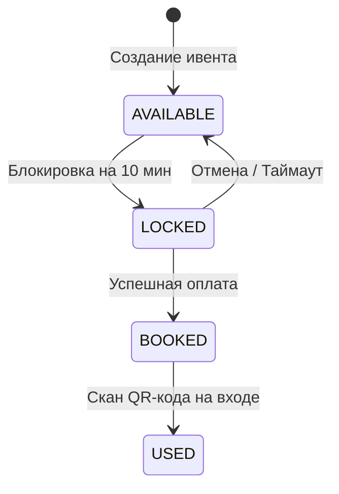

# Архитектура T-RESERVE ENGINE

> Высоконагруженная система бронирования билетов с защитой от Race Condition

> Команда: 5 чел | Срок: 6–7 недель

---

## Технологический стек

| Слой | Технология | Обоснование |
|---|---|---|
| Runtime | **Java 21** (Virtual Threads) | 1000+ concurrent без reactive |
| Framework | **Spring Boot 3.3** | Security, Data JPA, Actuator |
| Database | **PostgreSQL 16** | `SELECT FOR UPDATE NOWAIT` — ядро Race Condition protection |
| Cache & Locks | **Redis 7** | Распределенные блокировки (`SETNX`) и кэш-слой для карты мест |
| Object Storage | **MinIO (S3)** | Хранение сгенерированных PDF-билетов и QR-кодов |
| Message Broker | **RabbitMQ 3.13** | Отправка билетов на почту |
| Auth | **JWT** (jjwt) | Stateless, роли USER/ADMIN |
| Frontend | **Custom CSS + Angular**| Pure CSS движок (Glassmorphism), без тяжелых UI-библиотек |
| Real-Time | **WebSockets (STOMP)** | Мгновенное обновление карты мест без REST-поллинга |
| Migrations | **Flyway** | Version-controlled schema |
| CI/CD | **GitHub Actions + Railway** | `mvn verify`, Playwright E2E тесты, деплой в Railway |
| Контейнеризация | **Docker Compose** | Полная изоляция сервисов (`docker-compose.prod.yml`) |

---

## Двухуровневая блокировка (Redis + PostgreSQL)

Мы используем двухуровневую систему: **Redis `SETNX`** + **PostgreSQL `SELECT FOR UPDATE NOWAIT`**.

### Как это работает

```
Юзер кликнул место A-1 
  → Redis SETNX (distributed lock)
    → Если занято в Redis → мгновенный отказ (0.5ms)
    → Если свободно → Spring Boot → BEGIN TRANSACTION
      → PostgreSQL: SELECT * FROM tickets WHERE id=1 FOR UPDATE NOWAIT
        → Строка свободна? → UPDATE status='LOCKED', user_id=X
      → COMMIT
```

**Преимущества:**
- **Redis** фильтрует 99% паразитной нагрузки при массовых кликах в одну точку.
- **PostgreSQL** выступает финальным источником правды (ACID), исключая любой рассинхрон.
- Использование `NOWAIT` гарантирует отсутствие дедлоков и зависших транзакций в СУБД.

---

## Жизненный цикл билета (State Machine)



| Переход | Триггер | Механизм |
|---|---|---|
| AVAILABLE → LOCKED | `POST /bookings/lock` | Redis Lock + PG `FOR UPDATE NOWAIT` |
| LOCKED → BOOKED | `POST /bookings/{id}/confirm` | Проверка user + TTL |
| LOCKED → AVAILABLE | `DELETE /bookings/{id}` | Ручная отмена корзины |
| LOCKED → AVAILABLE | SafetyNet (10 мин) | `@Scheduled` авто-отмена просроченных локов |
| BOOKED → USED | `POST /admin/checkin/{token}` | Онлайн-валидация QR-кода контролером |

---

## Кэширование (Redis)

При фоллбэке на long polling.
```
GET /api/events/{id}/seats — polling каждые 3 сек

Без кэша: 100 юзеров × 0.33 RPS = 33 SQL запроса/сек к PG
С кэшем:  1 SQL запрос каждые 10 сек на ивент (TTL)
```

**Стратегия:** Cache-Aside
- `@Cacheable("seats")` — при cache miss → PG → Redis
- `@CacheEvict("seats")` — при lock/confirm/cancel/safety-net

---
## Real-Time Синхронизация (WebSockets)

Вместо ресурсоемкого REST-поллинга внедрена реактивная синхронизация:
- Клиент устанавливает **WebSocket (STOMP)** соединение.
- При любом изменении статуса места (Lock, Confirm, Cancel, SafetyNet-таймаут), `BookingService` мгновенно пушит событие в брокер сообщений.
- UI всех подключенных пользователей обновляет цвета мест за миллисекунды без необходимости делать запросы в БД.

---

## Интеграция MinIO и генерация PDF

При успешной брони система на лету генерирует электронный билет:
1. **OpenPDF** собирает билет с динамическим QR-кодом (содержащим токен валидации UUID).
2. Файл выгружается в **MinIO S3 Bucket**.
3. В базу сохраняется `pdf_url`. Последующие запросы отдают готовый файл из кэша хранилища без повторной перегенерации.


## Структура проекта

```
T-RESERVE-ENGINE/ (Root)
├── treserve-common/      # Общие DTO, Exceptions, базовые интерфейсы
├── treserve-booking/     # ЯДРО: BookingService, Race Condition защита (Redis+PG), WebSockets, SafetyNet
├── treserve-app/         # Точка входа: API контроллеры, Auth (JWT), Admin-панель, PDF-генератор, MinIO
├── frontend/             # SPA на Angular (Custom Vanilla CSS, STOMP WebSockets)
├── load-tests/           # k6 скрипты для тестирования высокой нагрузки
├── nginx/                # Конфиги балансировщика
├── prometheus/           # Сбор метрик (Prometheus + Grafana)
├── docker-compose.yml    # Локальная разработка (PostgreSQL, Redis, MinIO, RabbitMQ)
└── docker-compose.prod.yml # Production сборка (+ Nginx, мониторинг)
```

---

## API Endpoints (Ключевые)

| Метод | Endpoint | Доступ | Описание |
|---|---|---|---|
| POST | `/api/auth/login` | Public | Авторизация |
| GET | `/api/events/{id}/seats` | Public | Карта мест |
| POST | `/api/bookings/lock` | User | Заблокировать место |
| POST | `/api/bookings/{id}/confirm` | User | Подтвердить бронь |
| GET | `/api/events` | Public | Список мероприятий |
| GET | `/api/users/{id}` | User | Профиль пользователя |
| GET | `/api/tickets/{id}/download` | User | Скачать PDF-билет |
| POST | `/api/admin/checkin/{token}`| Admin | Скан QR-кода (вход) |

*(Полный список в [API_ENDPOINTS.md](./API_ENDPOINTS.md))*

---

## Тестирование и Нагрузка

| Тип | Инструмент | Покрытие |
|---|---|---|
| Unit | **JUnit 5 + Mockito** | Бизнес-логика (`BookingService`, `AdminService`) |
| Load Testing | **k6 (1000 VUs)** | Стресс-тест Race Condition. 1000 одновременных кликов в 1 мс, смешанная нагрузка (покупка, бронирование, просмотр), проверка деградации редис увеличение RPS до 5000+|
| E2E (UI) | **Playwright** | Автоматизированная проверка фронтенда в браузере (CI) |
| Integration| **Testcontainers** | База данных в изоляции |
| CI | **GitHub Actions** | `mvn verify` + Playwright на каждый пуш |
---

## В Роадмапе

- Venue Builder (визуальный редактор зала)
- Telegram-бот для просмотра билетов
- Платёжная интеграция (ЮKassa)