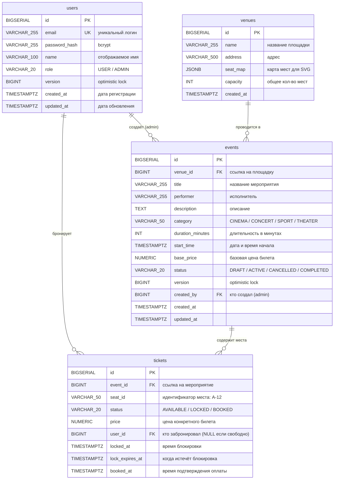
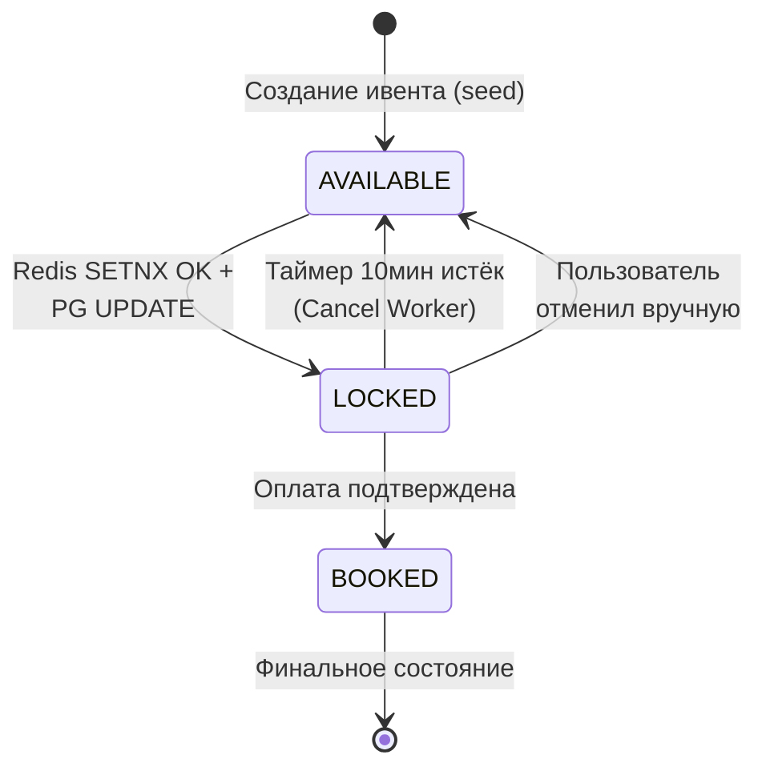

# 📊 T-RESERVE ENGINE — Документация БД (для менторов)

> Версия: 1.1 | Дата: 11.04.2026
> СУБД: PostgreSQL 16
> Обновление: добавлены `@Version` (optimistic lock), `category`, `duration_minutes`

---

## ER-диаграмма



---

## Описание таблиц

### 1. `users` — Пользователи системы

| Поле | Тип | Ограничения | Описание |
|---|---|---|---|
| `id` | BIGSERIAL | PK, auto-increment | Уникальный идентификатор |
| `email` | VARCHAR(255) | UNIQUE, NOT NULL | E-mail = логин. Используется для JWT auth |
| `password_hash` | VARCHAR(255) | NOT NULL | Хеш пароля (bcrypt, cost=12). Оригинал не хранится |
| `name` | VARCHAR(100) | — | Отображаемое имя пользователя |
| `role` | VARCHAR(20) | CHECK ('USER','ADMIN') | Роль. USER — обычный, ADMIN — управляет ивентами |
| `version` | BIGINT | DEFAULT 0 | Optimistic lock — предотвращает concurrent updates профиля |
| `created_at` | TIMESTAMPTZ | DEFAULT NOW() | Дата регистрации |
| `updated_at` | TIMESTAMPTZ | DEFAULT NOW() | Дата последнего обновления профиля |

**Зачем**: Хранение учётных записей и ролевой модели. JWT-токен содержит `userId` и `role`, пароль проверяется при логине через BCrypt.

---

### 2. `venues` — Площадки (кинотеатры, стадионы, концертные залы)

| Поле | Тип | Ограничения | Описание |
|---|---|---|---|
| `id` | BIGSERIAL | PK | Уникальный идентификатор |
| `name` | VARCHAR(255) | NOT NULL | Название: "Олимпийский", "Зал №3" |
| `address` | VARCHAR(500) | — | Физический адрес |
| `seat_map` | JSONB | NOT NULL | JSON-структура карты мест для SVG-рендера на фронте |
| `capacity` | INT | NOT NULL | Общее количество мест |
| `created_at` | TIMESTAMPTZ | DEFAULT NOW() | Дата создания |

**Зачем**: Отделяет площадку от мероприятия. Один зал может принимать множество мероприятий. `seat_map` хранит координаты для фронтенд-рендера.

**Формат `seat_map` (JSONB)**:
```json
{
  "rows": [
    {
      "label": "A",
      "seats": [
        {"seatId": "A-1", "col": 1, "x": 50, "y": 100, "category": "VIP"},
        {"seatId": "A-2", "col": 2, "x": 80, "y": 100, "category": "VIP"},
        {"seatId": "A-3", "col": 3, "x": 110, "y": 100, "category": "STANDARD"}
      ]
    },
    {
      "label": "B",
      "seats": [
        {"seatId": "B-1", "col": 1, "x": 50, "y": 140, "category": "STANDARD"}
      ]
    }
  ],
  "stagePosition": {"x": 200, "y": 20, "width": 300, "height": 50}
}
```

---

### 3. `events` — Мероприятия

| Поле | Тип | Ограничения | Описание |
|---|---|---|---|
| `id` | BIGSERIAL | PK | Уникальный идентификатор |
| `venue_id` | BIGINT | FK → venues(id), NOT NULL | На какой площадке проводится |
| `title` | VARCHAR(255) | NOT NULL | Название: "Концерт Макса Коржа" |
| `performer` | VARCHAR(255) | — | Исполнитель/команда |
| `description` | TEXT | — | Полное описание мероприятия |
| `category` | VARCHAR(50) | — | Тип: CINEMA, CONCERT, SPORT, THEATER. Для фильтрации |
| `duration_minutes` | INT | — | Длительность в минутах (120 для кино, 90 для матча) |
| `start_time` | TIMESTAMPTZ | NOT NULL | Дата и время начала |
| `base_price` | NUMERIC(10,2) | NOT NULL | Базовая цена билета (может варьироваться по категории) |
| `status` | VARCHAR(20) | CHECK | Жизненный цикл мероприятия |
| `version` | BIGINT | DEFAULT 0 | Optimistic lock — защита от concurrent admin edits |
| `created_by` | BIGINT | FK → users(id) | Какой админ создал |
| `created_at` | TIMESTAMPTZ | DEFAULT NOW() | — |
| `updated_at` | TIMESTAMPTZ | DEFAULT NOW() | — |

**Категории мероприятий**:
- `CINEMA` — кинопоказы (сессии: один фильм → несколько events с разным start_time)
- `CONCERT` — концерты, фестивали
- `SPORT` — матчи, соревнования
- `THEATER` — спектакли, балет, опера

**Статусы мероприятий**:
- `DRAFT` — создано, но не опубликовано
- `ACTIVE` — открыто для бронирования
- `CANCELLED` — отменено
- `COMPLETED` — мероприятие прошло

---

### 4. `tickets` — Билеты/Места (⚡ главная таблица)

| Поле | Тип | Ограничения | Описание |
|---|---|---|---|
| `id` | BIGSERIAL | PK | Уникальный идентификатор билета |
| `event_id` | BIGINT | FK → events(id), NOT NULL | К какому мероприятию |
| `seat_id` | VARCHAR(50) | NOT NULL | Идентификатор места: "A-12", "B-5" |
| `status` | VARCHAR(20) | CHECK, DEFAULT 'AVAILABLE' | Текущее состояние места |
| `price` | NUMERIC(10,2) | — | Цена конкретного билета (может != base_price) |
| `user_id` | BIGINT | FK → users(id), nullable | Кто забронировал. NULL = свободно |
| `locked_at` | TIMESTAMPTZ | nullable | Когда было заблокировано (для расчёта таймера) |
| `lock_expires_at` | TIMESTAMPTZ | nullable | locked_at + 10 минут. Cancel Worker проверяет это |
| `booked_at` | TIMESTAMPTZ | nullable | Когда оплата подтверждена |

> [!NOTE]
> Для бронирования используется Redis distributed lock (SETNX) + PG pessimistic lock (FOR UPDATE SKIP LOCKED).

**Constraint**: `UNIQUE(event_id, seat_id)` — одно место на одно мероприятие не может дублироваться.

**Жизненный цикл билета (статусы)**:


> [!IMPORTANT]
> **Один ряд таблицы `tickets` = одно конкретное место на одно конкретное мероприятие.** При создании ивента на площадку с 500 местами — создаётся 500 строк в tickets со статусом AVAILABLE.

---

## Связи между таблицами

```
users (1) ──── (N) tickets     "один юзер → много борированных билетов"
users (1) ──── (N) events      "один админ → много созданных ивентов"
venues (1) ──── (N) events     "одна площадка → много мероприятий"
events (1) ──── (N) tickets    "одно мероприятие → много мест/билетов"
```

---

## Что сознательно НЕ вынесено в отдельные таблицы (и почему)

| Вариант | Почему НЕ делаем |
|---|---|
| `orders` (заказы) | MVP: один lock = один ticket. Нет корзины. Можно добавить позже |
| `payments` (оплаты) | Mock payment. Логика подтверждения прямо в BookingService. Для Stripe — добавить позже |
| `seat_categories` | Категория хранится в `seat_map` JSONB. Для MVP не нужна отдельная таблица |
| `notifications` | Fire-and-forget в Python сервис. Не храним историю нотификаций |
