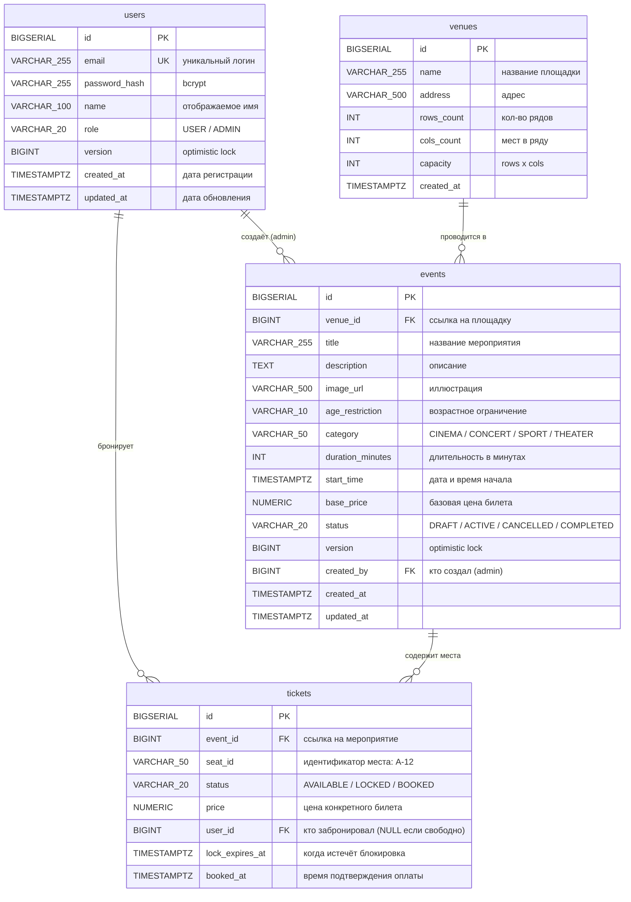
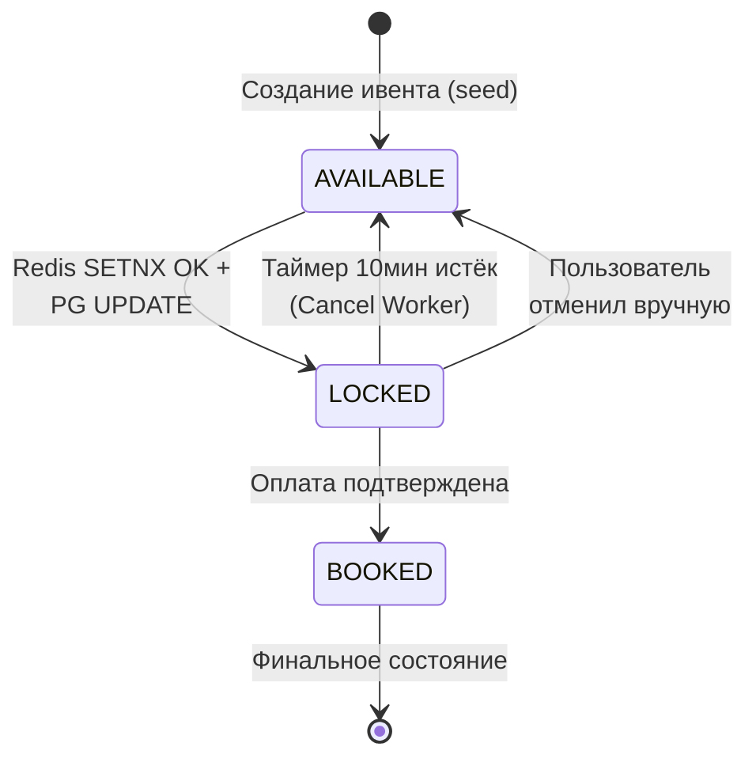

# 📊 T-RESERVE ENGINE — Документация БД (для менторов)

> Версия: 1.2 | Дата: 11.04.2026
> СУБД: PostgreSQL 16

---

## ER-диаграмма



---

## Описание таблиц

### 1. `users` — Пользователи системы

| Поле | Тип | Ограничения | Описание |
|---|---|---|---|
| `id` | BIGSERIAL | PK, auto-increment | Уникальный идентификатор |
| `email` | VARCHAR(255) | UNIQUE, NOT NULL | E-mail = логин. Используется для JWT auth |
| `password_hash` | VARCHAR(255) | NOT NULL | Хеш пароля (bcrypt, cost=12). Оригинал не хранится |
| `name` | VARCHAR(100) | — | Отображаемое имя пользователя |
| `role` | VARCHAR(20) | CHECK ('USER','ADMIN') | Роль. USER — обычный, ADMIN — управляет ивентами |
| `version` | BIGINT | DEFAULT 0 | Optimistic lock — предотвращает concurrent updates профиля |
| `created_at` | TIMESTAMPTZ | DEFAULT NOW() | Дата регистрации |
| `updated_at` | TIMESTAMPTZ | DEFAULT NOW() | Дата последнего обновления профиля |

**Зачем**: Хранение учётных записей и ролевой модели. JWT-токен содержит `userId` и `role`, пароль проверяется при логине через BCrypt.

---

### 2. `venues` — Площадки (кинотеатры, стадионы, концертные залы)

| Поле | Тип | Ограничения | Описание |
|---|---|---|---|
| `id` | BIGSERIAL | PK | Уникальный идентификатор |
| `name` | VARCHAR(255) | NOT NULL | Название: "Октябрь — Зал 1", "Лужники — Трибуна А" |
| `address` | VARCHAR(500) | — | Физический адрес |
| `rows_count` | INT | NOT NULL | Количество рядов (A, B, C...) |
| `cols_count` | INT | NOT NULL | Количество мест в ряду (1, 2, 3...) |
| `capacity` | INT | NOT NULL | Общее количество мест (rows × cols) |
| `created_at` | TIMESTAMPTZ | DEFAULT NOW() | Дата создания |

**Зачем**: Отделяет площадку от мероприятия. Один зал может принимать множество мероприятий.

**Как работает матрица мест**: Карта зала — простая сетка. Фронт рисует таблицу `rows_count × cols_count`. Идентификатор места генерируется автоматически: ряд A = места A-1, A-2, ..., A-{cols_count}; ряд B = места B-1, B-2 и т.д.

```
Пример: rows_count=3, cols_count=5 → Зал на 15 мест

         1      2      3      4      5
  A   [ A-1 ][ A-2 ][ A-3 ][ A-4 ][ A-5 ]
  B   [ B-1 ][ B-2 ][ B-3 ][ B-4 ][ B-5 ]
  C   [ C-1 ][ C-2 ][ C-3 ][ C-4 ][ C-5 ]
```

---

### 3. `events` — Мероприятия

| Поле | Тип | Ограничения | Описание |
|---|---|---|---|
| `id` | BIGSERIAL | PK | Уникальный идентификатор |
| `venue_id` | BIGINT | FK → venues(id), NOT NULL | На какой площадке проводится |
| `title` | VARCHAR(255) | NOT NULL | Название: "Концерт Макса Коржа", "Inception" |
| `description` | TEXT | — | Полное описание мероприятия |
| `image_url` | VARCHAR(500) | — | Ссылка на иллюстрацию (постер, обложка) |
| `age_restriction` | VARCHAR(10) | — | Возрастное ограничение: "0+", "6+", "12+", "16+", "18+" |
| `category` | VARCHAR(50) | — | Тип: CINEMA, CONCERT, SPORT, THEATER. Для фильтрации |
| `duration_minutes` | INT | — | Длительность в минутах (120 для кино, 90 для матча) |
| `start_time` | TIMESTAMPTZ | NOT NULL | Дата и время начала |
| `base_price` | NUMERIC(10,2) | NOT NULL | Базовая цена билета |
| `status` | VARCHAR(20) | CHECK | Жизненный цикл мероприятия |
| `version` | BIGINT | DEFAULT 0 | Optimistic lock — защита от concurrent admin edits |
| `created_by` | BIGINT | FK → users(id) | Какой админ создал |
| `created_at` | TIMESTAMPTZ | DEFAULT NOW() | — |
| `updated_at` | TIMESTAMPTZ | DEFAULT NOW() | — |

**Категории мероприятий**:
- `CINEMA` — кинопоказы (сессии: один фильм → несколько events с разным start_time)
- `CONCERT` — концерты, фестивали
- `SPORT` — матчи, соревнования
- `THEATER` — спектакли, балет, опера

**Статусы мероприятий**:
- `DRAFT` — создано, но не опубликовано
- `ACTIVE` — открыто для бронирования
- `CANCELLED` — отменено
- `COMPLETED` — мероприятие прошло

---

### 4. `tickets` — Билеты/Места (⚡ главная таблица)

| Поле | Тип | Ограничения | Описание |
|---|---|---|---|
| `id` | BIGSERIAL | PK | Уникальный идентификатор билета |
| `event_id` | BIGINT | FK → events(id), NOT NULL | К какому мероприятию |
| `seat_id` | VARCHAR(50) | NOT NULL | Идентификатор места: "A-12", "B-5" |
| `status` | VARCHAR(20) | CHECK, DEFAULT 'AVAILABLE' | Текущее состояние места |
| `price` | NUMERIC(10,2) | — | Цена конкретного билета |
| `user_id` | BIGINT | FK → users(id), nullable | Кто забронировал. NULL = свободно |
| `lock_expires_at` | TIMESTAMPTZ | nullable | Когда истечёт блокировка. Cancel Worker проверяет это |
| `booked_at` | TIMESTAMPTZ | nullable | Когда оплата подтверждена |

> [!NOTE]
> Для бронирования используется Redis distributed lock (SETNX) + PG pessimistic lock (FOR UPDATE SKIP LOCKED).

**Constraint**: `UNIQUE(event_id, seat_id)` — одно место на одно мероприятие не может дублироваться.

**Жизненный цикл билета (статусы)**:


> [!IMPORTANT]
> **Один ряд таблицы `tickets` = одно конкретное место на одно конкретное мероприятие.** При создании ивента на площадку с 500 местами — создаётся 500 строк в tickets со статусом AVAILABLE.
---

## Индексы

| Индекс | Поля | Зачем |
|---|---|---|
| `idx_tickets_event_status` | `(event_id, status)` | Быстрый SELECT всех мест ивента по статусу. Главный запрос карты |
| `idx_tickets_user` | `(user_id) WHERE user_id IS NOT NULL` | Partial index: история покупок пользователя |
| `idx_tickets_locked_expires` | `(lock_expires_at) WHERE status='LOCKED'` | Partial index: Safety net cron ищет просроченные LOCKED билеты |
| `idx_events_status_time` | `(status, start_time)` | Быстрый фильтр активных ивентов по дате |

---


## Связи между таблицами

```
users (1) ──── (N) tickets     "один юзер → много борированных билетов"
users (1) ──── (N) events      "один админ → много созданных ивентов"
venues (1) ──── (N) events     "одна площадка → много мероприятий"
events (1) ──── (N) tickets    "одно мероприятие → много мест/билетов"
```

---

## Что сознательно НЕ вынесено в отдельные таблицы (и почему)

| Вариант | Почему НЕ делаем |
|---|---|
| `orders` (заказы) | MVP: один lock = один ticket. Нет корзины. Можно добавить позже |
| `payments` (оплаты) | Бесплатный payment. Логика подтверждения прямо в BookingService. Для Stripe — добавить позже |
| `seat_categories` (VIP/Standard) | Все места одной цены для MVP. Категории — на следующую итерацию |
| `notifications` | Fire-and-forget в Python сервис. Не храним историю нотификаций |
